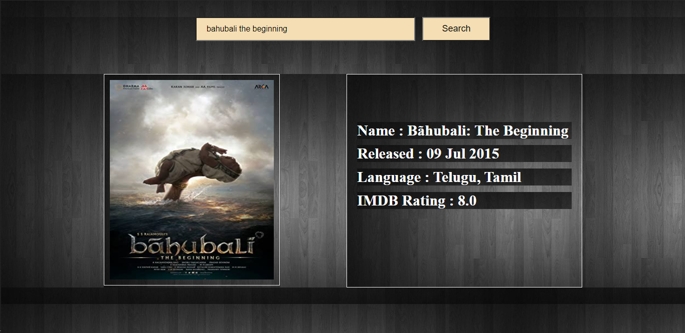
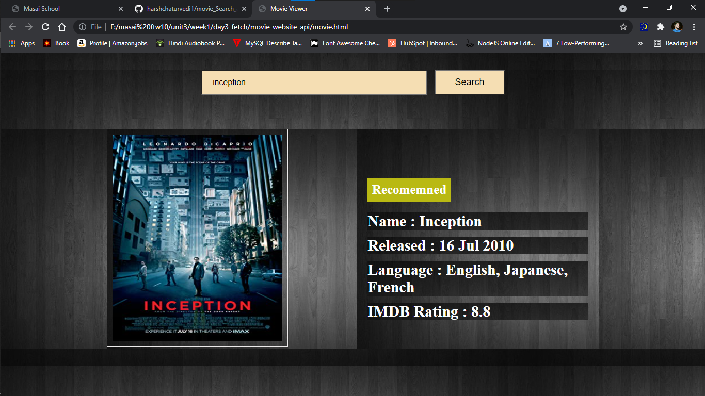

# movie_Search_api

here user can search their query in the seach box and result will we feed from server using api, user can see all the details of the movie they searched for

## sample images

### bahubali the beginning search

### Inception search

### result not found

### api link > http://www.omdbapi.com
